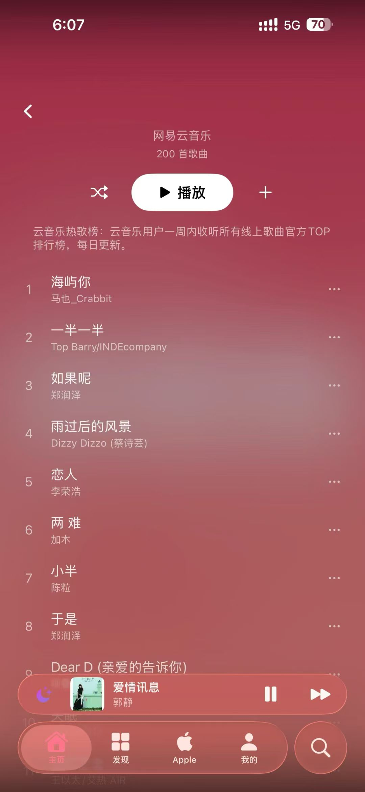
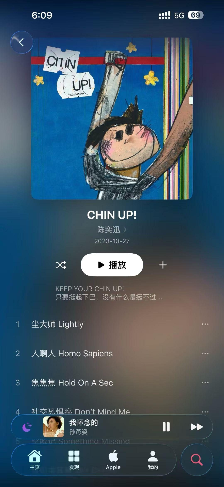
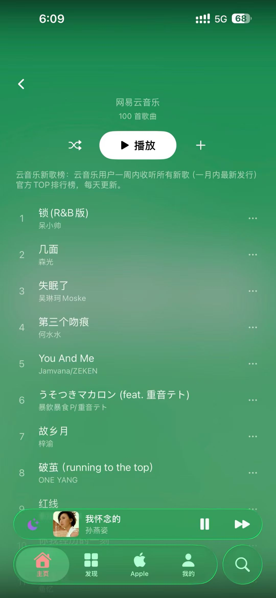
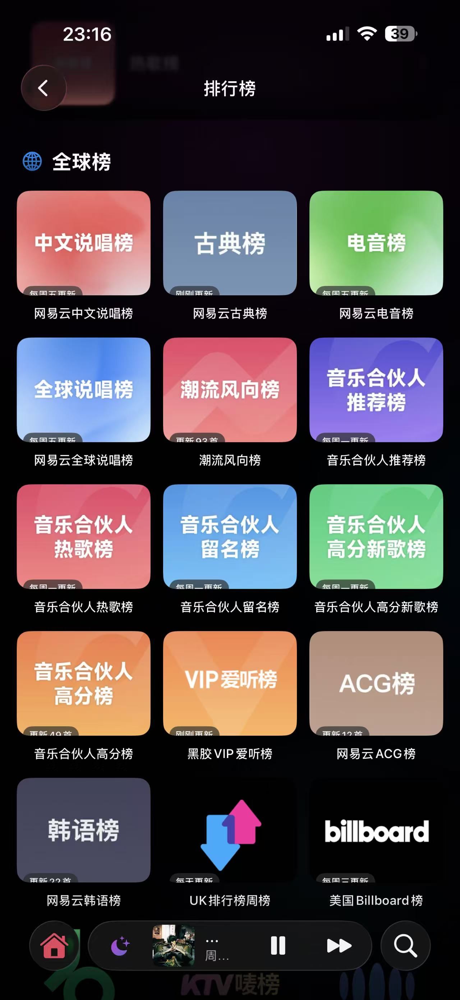

<h1 align="center">🎵 Youmi Music iOS</h1>

<p align="center">
  <strong>一款功能丰富的 iOS 音乐播放器，融合网易云音乐与 Apple Music 双平台资源</strong>
</p>

<p align="center">
  基于 SwiftUI 构建 · 支持 iOS 17+ · 支持 WidgetKit 桌面歌词组件
</p>

---

## 📱 应用截图

| 热歌榜 | 专辑详情 | 新歌榜 | 全球排行榜 |
|:---:|:---:|:---:|:---:|
|  |  |  |  |

---

## ✨ 功能特性

### 🎧 音乐播放
- 基于 AVPlayer 的高品质音频播放引擎
- 多种播放模式：顺序播放 / 随机播放 / 单曲循环
- 多音质选择：标准 / Hi-Res / 无损 / 母带 / 空间音频
- 迷你播放器 + 全屏播放器双模式
- 后台持续播放
- 播放进度缓冲状态实时显示

### 🎤 歌词系统
- 逐行歌词同步显示
- **逐字卡拉OK歌词**（YRC 格式），30fps 动画逐字高亮
- 歌词翻译显示（中英对照等）
- 点击歌词跳转播放位置
- 桌面歌词 Widget（锁屏/主屏幕实时歌词）
- Live Activity 实时活动歌词显示

### 🔍 搜索与发现
- 多类型搜索：歌曲 / 歌手 / 专辑
- 热搜榜单实时更新
- 搜索历史记录
- 分类发现（华语 / 韩语 / 古典 / 电音等）
- 个性化推荐歌单
- Banner 精选内容展示

### 📊 排行榜
- 网易云官方榜单（飙升榜 / 新歌榜 / 原创榜 / 热歌榜）
- 全球排行榜（Billboard / UK榜 / 韩语榜等）
- ACG榜 / 电音榜 / 说唱榜等分类榜单
- 音乐合伙人系列榜单
- 每日实时更新

### 🎵 双平台音源
- **网易云音乐**：完整 API 集成，歌曲 / 歌词 / 歌单 / 排行榜 / 评论
- **Apple Music**：MusicKit 框架集成，曲库搜索与播放
- 第三方音源扩展（QiShuiMusic）
- HLS 流媒体解析支持

### 📁 歌单与收藏
- 歌单详情浏览与播放
- 创建 / 编辑个人歌单
- 歌曲收藏（红心标记），跨设备同步
- 云盘音乐管理
- 支持 500+ 曲目大歌单分页加载

### 📥 下载与离线
- 队列式下载管理（3路并发下载）
- 下载进度实时追踪
- 失败自动重试
- 本地音乐导入（MP3 / M4A / AAC / WAV / FLAC / OGG）
- 离线播放已下载内容

### 💬 社交功能
- 歌曲评论浏览（推荐 / 热门 / 最新排序）
- 发表评论与回复
- 分线程评论展示
- 分页加载大量评论

### 🎨 主题与个性化
- **液态玻璃主题**（默认，磨砂玻璃效果）
- **Stranger Things 主题**（80年代霓虹风格，发光/闪烁/粒子特效）
- 浅色 / 深色 / 跟随系统 三种外观模式
- 主题设置持久化保存

### 😴 睡眠定时
- 倒计时模式（5-180 分钟可调）
- 播完当前曲目后停止
- 可视化倒计时显示

### 🎯 智能推荐
- 基于听歌历史的个性化推荐
- 心动模式（AI 智能选曲）
- 雷达歌单（新歌发现）
- 深夜电台（场景推荐）
- 最近播放记录

### 🖥 桌面组件 (WidgetKit)
- 歌词桌面 Widget（小/中/大尺寸）
- Live Activity 实时播放状态
- App Groups 数据同步

### 🚗 CarPlay
- CarPlay 车载模式支持

---

## 🏗 技术架构

| 项目 | 技术 |
|------|------|
| **UI 框架** | SwiftUI |
| **架构模式** | MVVM |
| **音频引擎** | AVFoundation / AVKit |
| **Apple Music** | MusicKit |
| **响应式编程** | Combine |
| **桌面组件** | WidgetKit + App Groups |
| **网络层** | URLSession + Cookie 管理 |
| **数据持久化** | UserDefaults + 文件系统 |

## ⚡ 性能优化

- WebView 预热（减少 3-7 秒加载延迟）
- Apple Music Token 预获取
- DNS + TCP 网络连接预热
- 键盘预加载（消除首次弹出延迟）
- Tab 切换零延迟（视图缓存 + Opacity 切换策略）
- API 请求去重（5分钟内相同请求返回缓存）
- 多级缓存系统（图片 / 音频流 / 动态封面 / API 响应）
- 触觉反馈（轻/中力度）

---

## 📂 项目结构

```
NeteaseMusic/
├── Models/                # 数据模型
│   ├── PlaylistModels.swift    # Track / Playlist / Album
│   ├── UserModels.swift        # 用户模型
│   └── LocalTrack.swift        # 本地音乐模型
├── Views/                 # 视图层 (34个文件)
│   ├── MainTabView.swift       # 主导航 (5个Tab)
│   ├── DiscoverView.swift      # 发现页
│   ├── SearchView.swift        # 搜索页
│   ├── LibraryView.swift       # 我的音乐
│   ├── PlayerView.swift        # 全屏播放器
│   ├── MiniPlayerView.swift    # 迷你播放器
│   ├── ToplistView.swift       # 排行榜
│   ├── PlaylistDetailView.swift# 歌单详情
│   ├── AlbumDetailView.swift   # 专辑详情
│   ├── ArtistDetailView.swift  # 歌手详情
│   ├── CommentView.swift       # 评论
│   ├── LoginView.swift         # 登录
│   ├── SettingsView.swift      # 设置
│   ├── Player/                 # 播放器子组件
│   └── ...
├── Services/              # 服务层 (26个文件)
│   ├── MusicService.swift      # 核心音乐API (100+接口)
│   ├── AudioPlayer.swift       # 播放引擎
│   ├── AppleMusicService.swift # Apple Music 集成
│   ├── AuthService.swift       # 认证服务
│   ├── NetworkService.swift    # 网络请求
│   ├── SongDownloadService.swift# 下载管理
│   ├── SongCacheService.swift  # 音频缓存
│   ├── ThemeManager.swift      # 主题管理
│   ├── CacheManager.swift      # 缓存管理
│   └── ...
├── ViewModels/            # 视图模型
├── Extensions/            # 扩展
└── Widgets/               # 桌面组件
    └── LyricWidget/            # 歌词Widget
```

---

## 🔐 登录方式

- 手机号 + 密码登录
- 手机号 + 验证码登录
- 二维码扫码登录
- Session 自动恢复

---

## 📋 主导航

| Tab | 名称 | 功能 |
|:---:|------|------|
| 🏠 | 主页 | Banner / 推荐歌单 / 最近播放 / 快捷入口 |
| 🔲 | 发现 | 分类浏览 / 新歌推荐 / 精选内容 |
| 🍎 | Apple | Apple Music 曲库 / 订阅播放 |
| 👤 | 我的 | 个人资料 / 歌单 / 云盘 / 下载 / 本地音乐 |
| 🔍 | 搜索 | 综合搜索 / 热搜 / 历史 |

---

## 🛠 环境要求

- iOS 17.0+
- Xcode 15.0+
- Swift 5.9+

---

## 📄 License

This project is for personal learning and research purposes only.

---

<p align="center">Made with ❤️ by Youmi Team</p>
